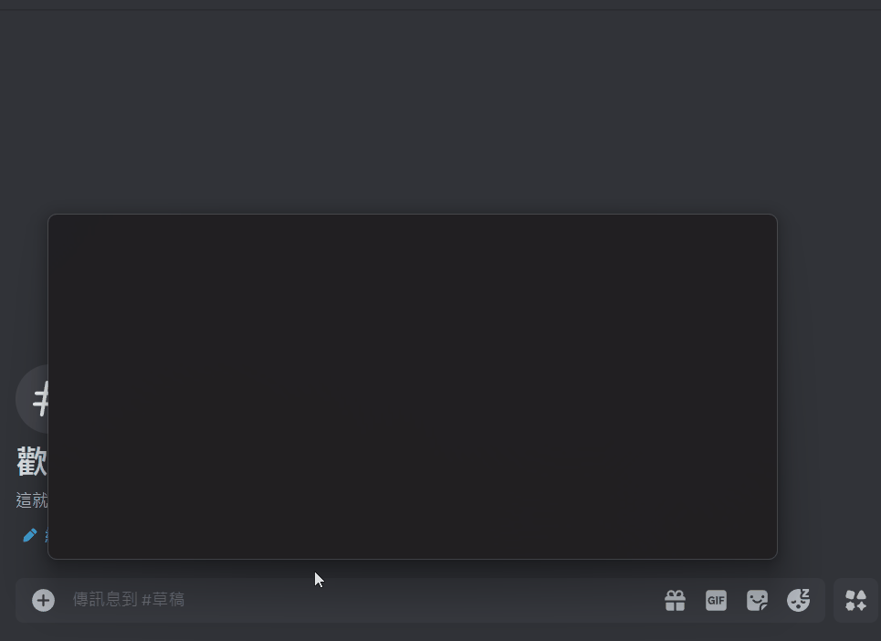

# PowerToys Run: MyGo Explorer
一款 PowerToys Run 擴充元件，用於快速搜尋 MyGO!!!!! 與 Ave Mujica 相關台詞並下載圖片至剪貼簿  
  


## PowerToys
[PowerToys](https://github.com/microsoft/PowerToys) 是由 Microsoft 開發的開源 Windows 工具集合，PowerToys Run 是其中的一個快速啟動器，可以讓使用者透過快捷鍵 (`Alt + Space`) 來快速搜尋應用程式、文件及執行其他功能

## 安裝
1. 確保已安裝 [PowerToys](https://github.com/microsoft/PowerToys) 並啟用 PowerToys Run。
2. 下載已建置的擴充元件 zip 檔後解壓縮：  
   [GitHub Releases](https://github.com/0miles/MyGoExplorer/releases)
3. 關閉 PowerToys
4. 將解壓縮後的 `Community.PowerToys.Run.Plugin.MyGoExplorer` 資料夾放入：
   ```
   %LOCALAPPDATA%\Microsoft\PowerToys\PowerToys Run\Plugins\
   ```
5. 開啟 PowerToys


## 使用方法
1. 開啟 PowerToys Run (`Alt + Space`)
2. 輸入：  
   ```
   mygo: <關鍵字>
   ```
3. 選擇結果
4. 圖片將自動下載並複製到剪貼簿
5. 直接貼上 (`Ctrl + V`) 即可使用圖片


## 暫存機制
- 下載的圖片將存儲於：  
  ```
  %TMP%\MyGoExplorer\
  ```
- 如果圖片已存在，則不會重新下載

## Credits
- 使用了 [hydra00400](https://home.gamer.com.tw/profile/index.php?&owner=hydra00400) 的台詞資料庫與 anon-tokyo API  
    https://forum.gamer.com.tw/C.php?bsn=60076&snA=8289364  

- 使用了 [yichen._.0403(宋逸晨)](https://www.threads.net/@yichen._.0403) 的 Tomorin API  
    https://www.threads.net/@yichen._.0403/post/DFj6WZACF2j
